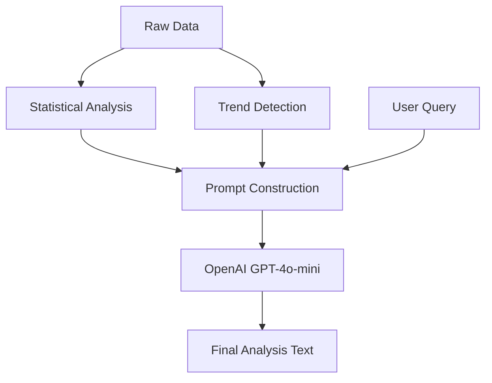

# Analysis Agent Implementation

## 개요
Analysis Agent는 원본 데이터를 통계적으로 분석하고, OpenAI를 활용하여 사용자 친화적이고 통찰력 있는 텍스트 분석 결과를 생성하는 시스템입니다.

## 주요 기능

### 1. 통계 분석 (Statistical Analysis)
- **기초 통계**: 평균, 중앙값, 표준편차 계산
- **성장률**: 전월 대비, 전년 동월 대비 성장률 계산
- **비교 분석**: 6개월 평균 대비 현재 수준 평가

### 2. 트렌드 탐지 (Trend Detection)
- **선형 회귀 (Linear Regression)**: 최근 6개월 데이터의 기울기(Slope) 계산
- **추세 판단**:
  - Slope > 0.05: 상승세 (Upward)
  - Slope < -0.05: 하락세 (Downward)
  - 그 외: 안정/보합세 (Stable)

### 3. 인사이트 생성 (Insight Generation)
- **Context-Aware**: 사용자 질문의 의도를 반영하여 답변 생성
- **Natural Language**: 딱딱한 템플릿 대신 자연스러운 한국어 문장 생성
- **Prompt Engineering**: 통계 데이터와 트렌드 정보를 구조화된 프롬프트로 제공

## 기술 스택
- **Language**: TypeScript
- **AI Model**: GPT-4o-mini
- **Libraries**: OpenAI SDK (No external stats library, custom implementation for lightweight)

## 코드 구조

```typescript
// analysisAgent.ts

export async function analyzeRevenueData(toolResult, userQuery, apiKey) {
    // 1. Calculate Stats
    const stats = calculateStatistics(toolResult);
    
    // 2. Detect Trend
    const trend = detectTrend(toolResult.monthlyRevenue);
    
    // 3. Generate Insights via LLM
    return generateInsights({ stats, trend, userQuery }, apiKey);
}
```

## 데이터 흐름


